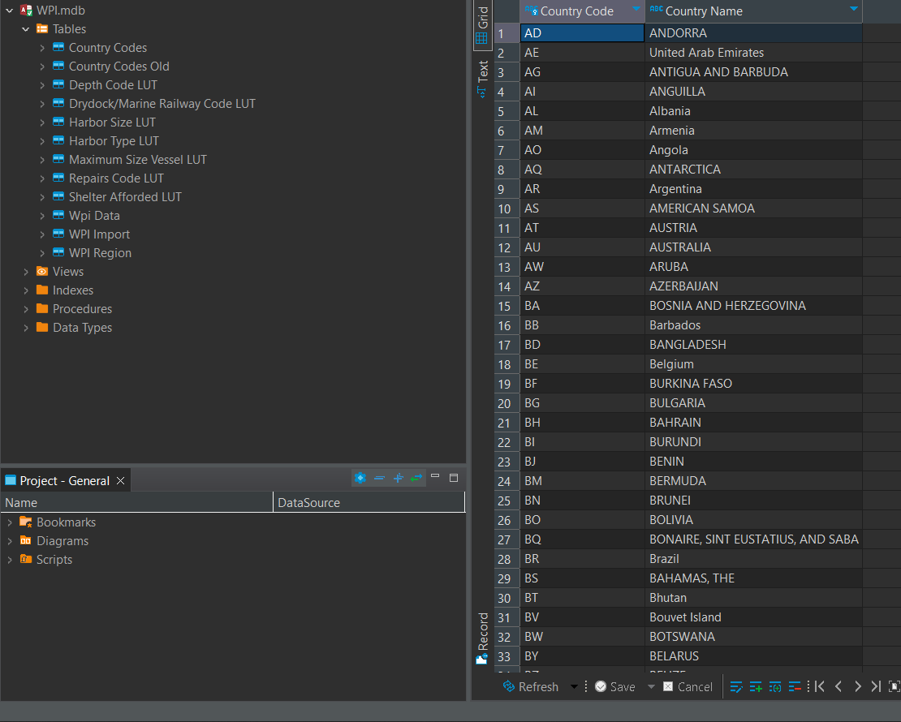
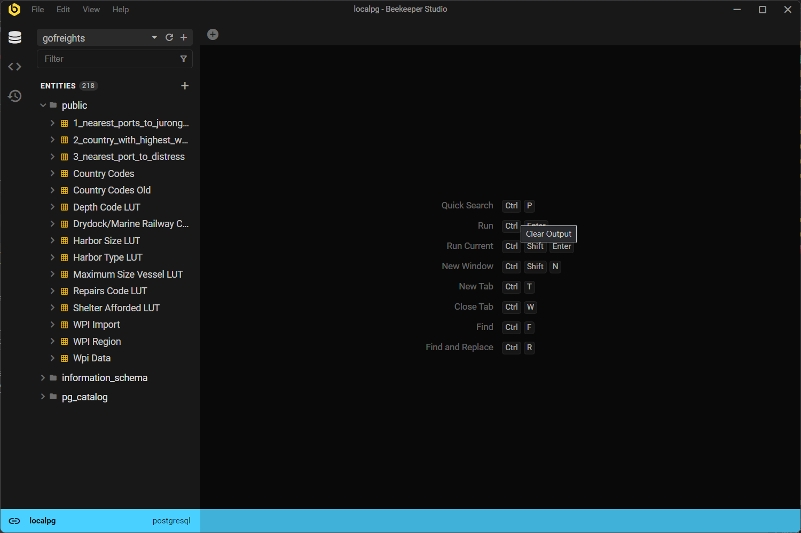
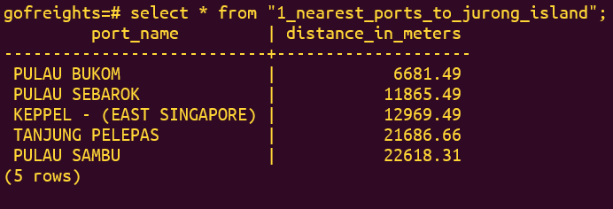
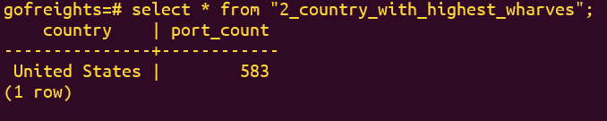
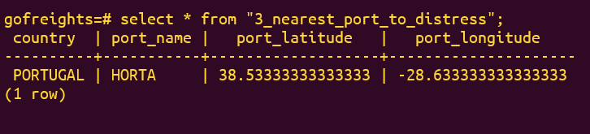

# Gofreights Data Project

The project contains code that downloads the World Port Index data from a google drive [link] contains the location and physical characteristics of, and the facilities
and services offered by major ports and terminals world-wide. Here I built a pipeline that extracts data from the downloaded zipped Microsoft Access database and migrated it to a modern relational database management system
(PostgreSQL). Few questions were also answered using the migrated data.

## Setup
- Clone the repo
- Change directory into the repo directory and create your virtual environment
- Install the required packages using `pip install -r requirements.txt`
- The `pyodbc` package requires a Microsoft Access driver, so be sure to install the driver on your machine before running the [extract_and_load.py](./extract_and_load.py) script. Information about driver installation can be found [here](https://www.microsoft.com/en-us/download/details.aspx?id=54920)

Note: The driver seems to be available for the windows operating system only.

## Extract and Load
Run the [extract_and_load.py](./extract_and_load.py) to extract the zipped database file `WPI.mdb` from the google drive link present in the same file. An image showing all the tables in the unzipped database file is shown below followed an image of the migrated version in Postgres.

## Analysis

1. 5 nearest ports to Singapore's JURONG ISLAND port? (country = 'SG', port_name = 'JURONG ISLAND')

    The haversine distance formula was used to compute the distance between singapore's jurong island and other ports using their latitudes and longitudes:

    $$d = 2r \sin^{-1} \sqrt{ \left( \sin^2 \left( \frac{\theta_2 - \theta_1}{2} \right) + \cos \theta_{1} \cos \theta_{2} \sin \left( \frac{\phi_{2} - \phi_{1}}{2}  \right) \right)}$$

    where $\theta_{1}, \theta_{2}$ are latitudes of positions 1 and 2 respectively and $\phi_{1}, \phi_{2}$ are the respective longitudes.

    
    

2. Country that has the largest number of ports with a cargo_wharf.

3. The nearest port to a distress caller
at coordinates of lat: 32.610982, long: -38.706256 seeking the nearest port with provisions, water, fuel_oil and diesel.

